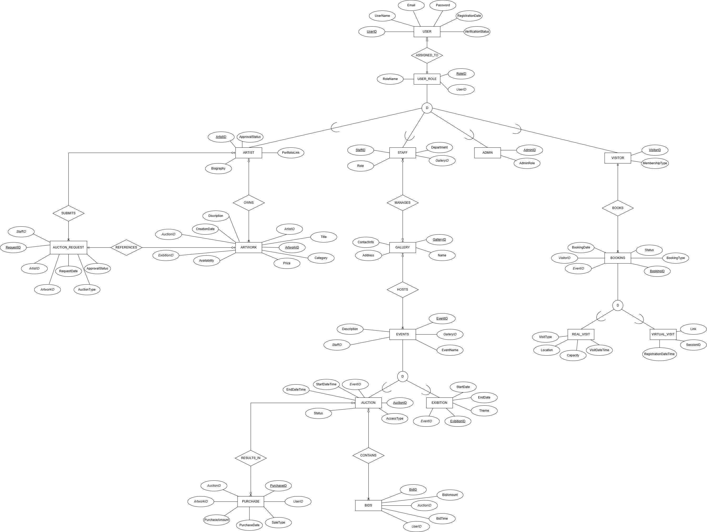

<div align="center">

# Art Gallery Management System

**A normalized SQL Server database for managing artists, artwork, exhibitions, auctions, bidding, and visitor bookings for an art gallery.**

[](https://www.microsoft.com/en-us/sql-server)
[](https://learn.microsoft.com/en-us/sql/t-sql/language-reference)
[](#database-schema)
[](LICENSE)

[Overview](#overview) •
[Features](#features) •
[ERD](#entity-relationship-diagram) •
[Schema](#database-schema) •
[Getting Started](#getting-started) •
[Usage](#usage-examples)

</div>

---

## Overview

The **Art Gallery Management System (AGMS)** is a relational database designed to run the day-to-day operations of an art gallery: cataloguing artwork and artists, scheduling exhibitions and auctions, tracking bids and sales, and managing visitor bookings — all from a single, normalized SQL Server database.

It was built as a full database-systems project, covering ER modeling, normalization to **3NF**, SQL Server implementation, and stored procedure development, and models a **17-entity domain** around four core workflows:

| Workflow | What it covers |
|---|---|
| **Artwork lifecycle** | Artist submission → exhibition or auction → final sale |
| **Auctions & bidding** | Auction requests, approvals, live bid tracking, results |
| **Visitor bookings** | Real (in-person) and virtual gallery visits |
| **Roles & access** | One user identity fans out into Admin, Artist, Visitor, and Staff |

> **Why this exists:** manual, spreadsheet-based gallery record-keeping leads to duplicate artist profiles, inconsistent pricing, double-booked visits, and unreliable sales reporting. AGMS centralizes that data into one enforced, queryable schema.

## Features

- **Role-based user model** — one `_USER` table backs `ADMIN`, `ARTIST`, `VISITOR`, and `STAFF` through a shared `USER_ROLE` table
- **Enforced business rules via `CHECK` constraints**
  - An artwork must belong to *either* an auction *or* an exhibition — never both, never neither
  - An auction or exhibition `StartDate` must be earlier than or equal to `EndDate`
  - Status fields (`Approved`, `Pending`, `Rejected`, `Confirmed`, `Canceled`, etc.) are restricted to valid values
- **Full referential integrity** across all 17 tables via foreign keys
- **Performance indexes** on frequently filtered and sorted columns (booking dates, artwork lookups, visit locations)
- **Stored procedures** for the most common operations — booking creation, bid placement, availability lookups, and sales reporting

## Entity-Relationship Diagram

<p align="center">
  
</p>

<p align="center"><em>A simplified version is also available: <a href="Basic%20ERD.png">Basic ERD.png</a></em></p>

## Database Schema

<details>
<summary><strong>Show all 17 tables</strong></summary>

| Table | Purpose |
|---|---|
| `GALLERY` | Physical gallery locations |
| `_USER` | Base login and account for every person in the system |
| `USER_ROLE` | Links a user to their functional role |
| `ADMIN` | Administrative users |
| `ARTIST` | Artists, their biography and portfolio, and approval status |
| `VISITOR` | Gallery visitors and membership tier |
| `STAFF` | Gallery employees and their department and gallery assignment |
| `EVENTS` | Umbrella event hosted by a gallery |
| `EXHIBITION` | A themed exhibition tied to an event |
| `AUCTION` | A live or online auction tied to an event |
| `ARTWORK` | An art piece, linked to its artist and to one auction or exhibition |
| `AUCTION_REQUEST` | Artist request to place an artwork into an auction |
| `BIDS` | Bids placed by users on an auction |
| `BOOKING` | A visitor's gallery visit booking |
| `REAL_VISIT` | In-person visit details (subtype of `BOOKING`) |
| `VIRTUAL_VISIT` | Online visit details (subtype of `BOOKING`) |
| `PURCHASE` | A completed artwork sale (direct or via auction) |

</details>

**Key relationships**

```
_USER  1───1  USER_ROLE  ──┬── ADMIN
                            ├── ARTIST
                            ├── VISITOR
                            └── STAFF

GALLERY 1──N STAFF          EVENTS 1──N EXHIBITION
GALLERY 1──N EVENTS          EVENTS 1──N AUCTION

ARTIST 1──N ARTWORK  ──  AUCTION    (N──1, mutually exclusive)
                     └─  EXHIBITION (N──1, mutually exclusive)

AUCTION 1──N BIDS            BOOKING 1──1 REAL_VISIT
AUCTION 1──N PURCHASE        BOOKING 1──1 VIRTUAL_VISIT
```

## Stored Procedures

| Procedure | Description |
|---|---|
| `Available_Artworks` | Returns all artworks currently marked `Available` |
| `New_Booking @VisitorID, @BookingDate, @BookingType, @StaffID` | Creates a confirmed visitor booking |
| `Place_Bid @BidID, @AuctionID, @UserID, @BidAmount, @BidTime` | Records a bid on an auction |
| `Purchase_Report @StartDate, @EndDate` | Returns purchases in a date range, joined with artwork and buyer info |
| `Update_Exhibition_Schedule @ExhibitionID, @StartDate, @EndDate` | Reschedules an exhibition |

## Getting Started

### Prerequisites

| Requirement | Notes |
|---|---|
| [Microsoft SQL Server](https://www.microsoft.com/en-us/sql-server) | 2019 or later — Express edition is sufficient |
| [SQL Server Management Studio (SSMS)](https://learn.microsoft.com/en-us/sql/ssms/download-sql-server-management-studio-ssms) | or the `sqlcmd` CLI |

### Installation

1. **Clone the repository**
   ```bash
   git clone https://github.com/<your-username>/ArtGalleryManagementSystem.git
   cd ArtGalleryManagementSystem
   ```

2. **Run the schema script** against your SQL Server instance

   Using SSMS: open `AGMS.sql` and click **Execute**.

   Using `sqlcmd`:
   ```bash
   sqlcmd -S <server_name> -i AGMS.sql
   ```

3. The script creates the `ArtGalleryManagementSystem` database along with all tables, constraints, indexes, and stored procedures — ready to use.

## Usage Examples

```sql
-- List all artworks currently available for sale
EXEC dbo.Available_Artworks;

-- Book a real visit for a visitor
EXEC dbo.New_Booking
    @VisitorID   = 1,
    @BookingDate = '2026-07-15',
    @BookingType = 'Real',
    @StaffID     = 2;

-- Place a bid in an active auction
EXEC dbo.Place_Bid
    @BidID     = 101,
    @AuctionID = 3,
    @UserID    = 5,
    @BidAmount = 2500.00,
    @BidTime   = '2026-07-01 14:30:00';

-- Get a sales report for a date range
EXEC dbo.Purchase_Report
    @StartDate = '2026-01-01',
    @EndDate   = '2026-06-30';
```

## Project Structure

```
ArtGalleryManagementSystem
├── AGMS.sql          # Full database schema: tables, constraints, indexes, stored procedures
├── AGMS.docx         # Full project report: introduction, objectives, scope, ERD justification
├── ERD.png           # Extended entity-relationship diagram
├── Basic ERD.png     # Simplified ER diagram
└── README.md         # Project documentation (this file)
```

## Tech Stack

| Layer | Technology |
|---|---|
| Database | Microsoft SQL Server (T-SQL) |
| Modeling | Draw.io (ERD design) |

## License

This project is available under the [MIT License](LICENSE) — feel free to use it for learning or as a starting point for your own gallery management system.

---

<div align="center">

*Originally developed as a Database Systems semester project — schema design, normalization to 3NF, and SQL Server implementation.*

[Back to top](#art-gallery-management-system)

</div>
